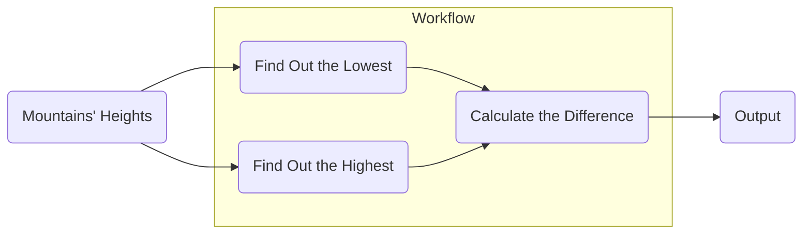
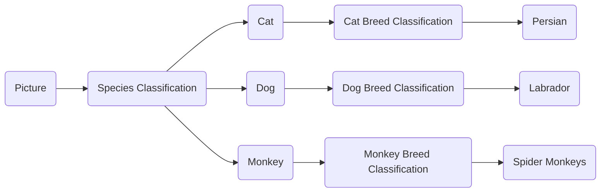

# Serve a Function

!!! question "Well, serving a function? Is it useful?"

    Of course it is.

    - If you have **a whole workflow of inferences**, it consists of many steps. Most of the time, you will implement a function to do this job. Now you can register the function immediately.

    - If you want to share some pre-processing or post-processing functions, now you've got your Robin, **Batman**!

    - Or a function is just enough for your job.

## Mission

We're given a list of mountains' heights. We need to find out the highest, the loweset, and the difference between the highest and the lowest.

It's a simple problem, let's solve it in a function to get you familiar with the concept:



## Create the Service and Register the Model

Save the following codes in `app.py`.

```python title="app.py" linenums="1"
from typing import List

from pinferencia import Server


def calc(data: List[int]) -> int:
    highest = max(data)
    lowest = min(data)
    return highest - lowest


service = Server()
service.register(model_name="mountain", model=calc)

```

## Start the Server

<div class="termy">

```console
$ uvicorn app:service --reload
INFO:     Started server process [xxxxx]
INFO:     Waiting for application startup.
INFO:     Application startup complete.
INFO:     Uvicorn running on http://127.0.0.1:8000 (Press CTRL+C to quit)
```

</div>

## Test the API

**Create a `test.py` with the codes below.**

!!! tips
    You need to have `requests` installed.
    ```bash
    pip install requests
    ```

```python title="test.py" linenums="1"
import requests

response = requests.post(
    url="http://localhost:8000/v1/models/mountain/predict",
    json={"data": [1000, 2000, 3000]},
)
difference = response.json()["data"]
print(f"Difference between the highest and lowest is {difference}m.")

```

**Run the script and check the result.**

<div class="termy">

```console
$ python test.py
Difference between the highest and lowest is 2000m.
```

</div>

## Further more

So now you have learned how to serve a model define as a `Class` or a `Function`.

If you have just a single model to serve, it's easy-peasy.

But in real world, you have custom codes like pre-processing and post-processing. And some tasks need multiple models to work together.

For example, if you want to predict an animal's breed, you may need the below workflow:



Deploying this on many platform or tools aren't that easy.

However, now you have **Pinferencia**, you have a choice!
