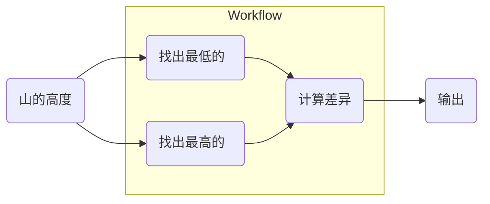
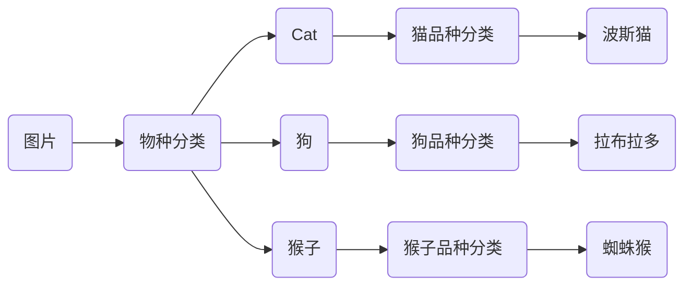

# 启动一个函数

!!! question "好吧，服务一个函数？有用吗？"

    当然是的。

    - 如果您有**一个完整的推理工作流程**，它包含许多步骤。大多数时候，您将实现一个函数来完成这项工作。现在您可以立即注册该函数。

    - 如果你想分享一些预处理或后处理功能，现在你有你的罗宾了，**蝙蝠侠**！

    - 或者一个函数对你的工作来说就足够了。

## 任务

我们得到了一份山脉高度的列表。我们需要找出最高、最低以及最高和最低之间的差异。

这是一个简单的问题，让我们在一个函数中解决它，让您更熟悉这个概念。



## 创建服务并注册模型


将以下代码保存在 `app.py` 中。

```python title="app.py" linenums="1"
from typing import List

from pinferencia import Server


def calc(data: List[int]) -> int:
    highest = max(data)
    lowest = min(data)
    return highest - lowest


service = Server()
service.register(model_name="mountain", model=calc)

```

## 启动服务器

<div class="termy">

```console
$ uvicorn app:service --reload
INFO:     Started server process [xxxxx]
INFO:     Waiting for application startup.
INFO:     Application startup complete.
INFO:     Uvicorn running on http://127.0.0.1:8000 (Press CTRL+C to quit)
```

</div>

## 测试 API

**使用下面的代码创建一个`test.py`。**

!!! tips
    You need to have `requests` installed.
    ```bash
    pip install requests
    ```

```python title="test.py" linenums="1"
import requests

response = requests.post(
    url="http://localhost:8000/v1/models/mountain/predict",
    json={"data": [1000, 2000, 3000]},
)
difference = response.json()["data"]
print(f"Difference between the highest and lowest is {difference}m.")

```

**运行脚本并检查结果。**

<div class="termy">

```console
$ python test.py
Difference between the highest and lowest is 2000m.
```

</div>

## 此外

现在你已经学会了如何将定义为“类”或“函数”模型上线。

如果您只有一个模型要服务，那很容易。

但在现实世界中，您有自定义代码，例如预处理和后处理。有些任务需要多个模型协同工作。

例如，如果您想预测动物的品种，您可能需要以下工作流程：



在许多平台或工具上部署它并不容易。

但是，现在您拥有 **Pinferencia**，您多了一个简单的选择！
